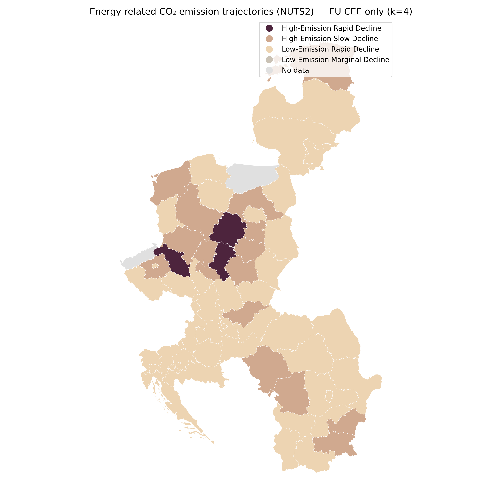
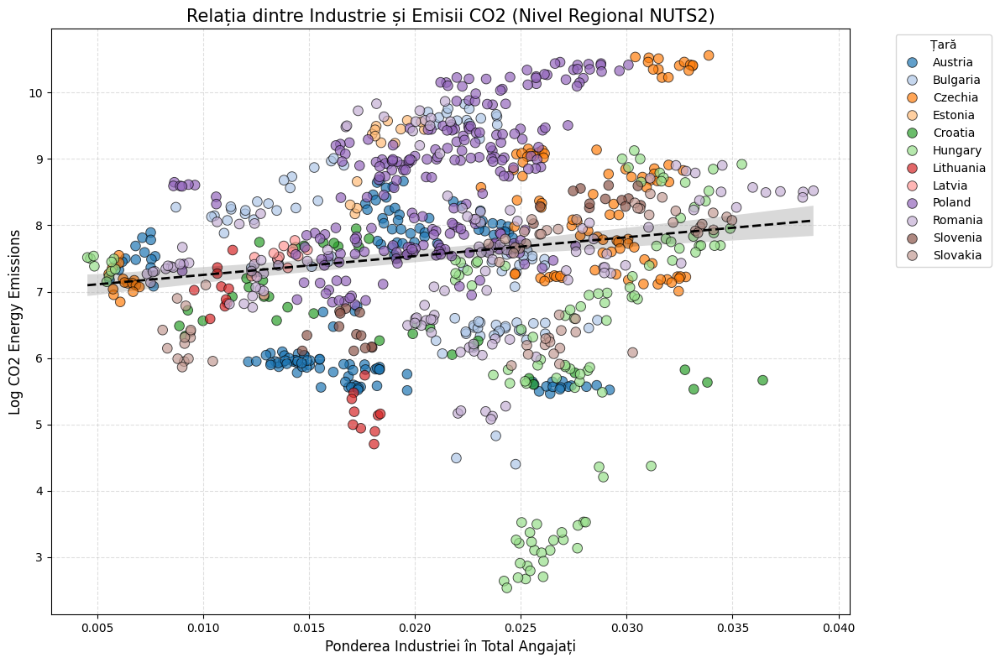
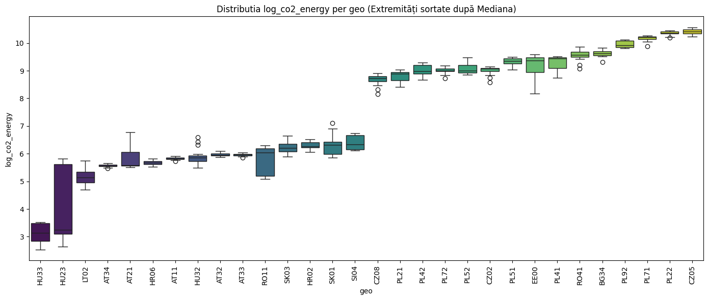

# Team-1
Structurally Differentiated Energy Transition Trajectories across Central and Eastern Europe

Authors: Mihai Iacob, Cosmin Osaci, Ariana Vlaicu, Ioana Zaharie

1. Introduction
Regional energy transitions across the European Union have unfolded in highly uneven ways. While EU climate and energy policies are formulated at a supranational level, their implementation and effects are deeply territorial, producing divergent outcomes across regions. Nowhere is this variation more visible than in Central and Eastern Europe (CEE), where areas sharing similar national contexts and exposure to common policy frameworks have followed markedly different energy transition paths. Understanding how and why regions engage differently in the energy transition has become increasingly important as decarbonisation strategies rely on regionally embedded capacities, infrastructures, and institutions.
Existing research has offered two broad perspectives on regional emissions and decarbonisation. One strand, drawing on spatial econometrics and regional science, emphasises the geographical clustering and persistence of emissions levels, highlighting spatial dependence and path stability across neighbouring regions (Vagnini et al., 2025). This work has demonstrated that emissions are often spatially autocorrelated and that regional emission profiles tend to change slowly over time. A second strand, rooted in political economy and institutional analysis, has instead stressed the role of structural and institutional differentiation. In this view, regional emissions outcomes reflect differences in economic structure, innovation systems, governance quality, and investment capacity, rather than spatial diffusion or neighbourhood effects (Bourdin & Perrot, 2025). While these approaches address different dimensions of regional inequality, both tend to focus on long-run emission levels or persistent disparities, offering limited insight into how regions actively engage with the recent phase of the energy transition.
This paper builds on the structural–institutional perspective advanced by Bourdin and Perrot (2025), while shifting the analytical focus from long-run outcomes to recent regional transition behaviour. Rather than treating decarbonisation primarily as a spatial diffusion process, we conceptualise regional energy transitions as observable trajectories shaped by territorially embedded production structures and energy-system constraints. Energy-related CO₂ emissions are used as an outcome indicator, not as a comprehensive measure of decarbonisation, but as a proxy capturing how regions respond to contemporary transition pressures within the energy sector. The analysis is deliberately confined to the post-2008 period, corresponding to the consolidation of EU climate governance, the maturation of the EU Emissions Trading System, and the acceleration of renewable energy deployment. This temporal focus allows us to examine how regions engage with the energy transition under current institutional and policy conditions, rather than attributing outcomes to long-term historical legacies.
Empirically, the paper examines NUTS-2 regions across Central and Eastern Europe, a macro-region characterised by pronounced internal heterogeneity. Rather than treating CEE as a homogeneous periphery, we explicitly investigate variation within the region. Using cluster analysis of recent energy-related CO₂ emissions dynamics, we identify distinct regional energy transition trajectories, capturing different modes of engagement with decarbonisation, ranging from rapid reductions to more gradual or stagnating pathways. These trajectories represent what regions do in the context of the energy transition, rather than benchmarks of success or failure.
The paper advances three interrelated objectives. First, it identifies and characterises distinct regional energy transition trajectories based on recent energy-related CO₂ emission dynamics. Second, it examines how these trajectories relate to differences in regional economic structure, with a particular focus on industrial employment intensity as an indicator of production-side carbon dependence. Third, it situates these trajectories geographically to assess their spatial distribution and to document intra-national heterogeneity, without presupposing spatial diffusion as an explanatory mechanism. By combining trajectory clustering with spatial mapping and distributional diagnostics, the paper contributes to debates on regional decarbonisation by showing that recent energy transition patterns in Central and Eastern Europe are best understood as structurally differentiated processes, marked by persistent regional polarization rather than convergence.
2. Literature review
2.1 Regional emissions, spatial dependence, and convergence debates
A growing body of literature has examined carbon emissions at the regional level within the European Union, motivated by the recognition that national aggregates conceal substantial sub-national heterogeneity. Much of this work has been dominated by spatial econometric and spatio-temporal approaches, which conceptualise regional emissions as spatially interdependent processes shaped by geographic proximity, spillovers, and diffusion mechanisms.
Recent contributions employ exploratory space–time data analysis, spatial autocorrelation metrics, and convergence frameworks to identify clustering patterns and long-run dynamics. Vagnini et al. (2025), for example, analyse industrial carbon emissions across EU NUTS-2 regions using global and local Moran’s I statistics and space–time transition matrices. Their findings reveal persistent spatial clustering and gradual convergence, with regions tending to remain within the same emissions category over time, suggesting strong spatial inertia
This strand of literature has been instrumental in demonstrating that emissions are not randomly distributed across space and that regional disparities persist despite overall declines. However, its explanatory focus remains largely centred on spatial dependence itself, that is, on whether regions resemble their neighbours, rather than on why regions subject to similar spatial and policy contexts exhibit divergent transition dynamics. As a result, spatial autocorrelation is often treated as both the object of analysis and the primary explanatory mechanism.
2.2 Structural and institutional explanations of regional decarbonisation
An alternative strand of research shifts attention away from spatial diffusion and towards structural and institutional differentiation as the key drivers of regional emissions outcomes. Rather than emphasising neighbourhood effects, this literature highlights differences in economic structure, innovation capacity, investment intensity, and governance quality.
Bourdin and Perrot (2025) advance a structural–institutional framework in which regional carbon outcomes are understood as the result of territorially embedded production systems and institutional capacities. Using EU regional data, they show that emissions are systematically associated with industrial specialisation, capital accumulation, and innovation performance, while spatial spillovers play a secondary role. Their results challenge the assumption that decarbonisation diffuses smoothly across space and instead point to persistent inequalities rooted in regional economic organisation
This perspective is particularly relevant for Central and Eastern Europe, where regions operate under common EU climate policy frameworks but display sharply divergent economic legacies and institutional capacities. From this viewpoint, regional emissions trajectories reflect differentiated abilities to mobilise investment, restructure production, and absorb policy signals, rather than spatial contagion effects.
2.3 Carbon lock-in and the persistence of energy-intensive systems
The persistence of high-emission regional trajectories has been theorised through the concept of carbon lock-in, which emphasises the co-evolution of technologies, infrastructures, institutions, and economic interests. Unruh’s (2006) seminal formulation defines carbon lock-in as a condition in which fossil-fuel-based energy systems become stabilised through increasing returns, network externalities, and institutional reinforcement, generating inertia that inhibits rapid decarbonisation
Importantly, carbon lock-in is not conceived as a purely technological phenomenon. Instead, it emerges from techno-institutional complexes in which energy infrastructures, regulatory frameworks, investment patterns, and labour markets mutually reinforce one another. This framework is particularly suited to regional analysis, as lock-in mechanisms often operate unevenly across territories depending on the spatial concentration of energy-intensive activities and institutional capacities.
Building on this insight, Seto et al. (2016) extend the lock-in concept by distinguishing multiple forms of lock-in, technological, institutional, behavioural, and infrastructural, and by highlighting their spatial embeddedness. They argue that emissions trajectories are shaped by place-specific configurations of infrastructure and governance, which constrain the pace and direction of transitions even under uniform policy pressures.
2.4 From spatial patterns to transition trajectories
Taken together, the reviewed literature highlights both the analytical advances and the limitations of existing approaches to regional decarbonisation. Spatial and spatio-temporal studies have convincingly demonstrated that carbon emissions are geographically clustered and persistent over time, revealing important patterns of regional polarization and inertia (e.g. Vagnini et al., 2025). However, by privileging spatial dependence as the primary explanatory mechanism, this strand tends to under-specify the structural and institutional conditions through which regional emissions trajectories are produced.
Structural–institutional approaches, by contrast, emphasise how regional emissions outcomes are shaped by inherited economic structures, investment capacity, innovation systems, and governance quality (Bourdin & Perrot, 2025). From this perspective, regions exposed to similar supranational policy frameworks may nonetheless follow sharply divergent decarbonisation paths due to differences in their ability to mobilise resources and reconfigure production systems. Energy geography scholarship further reinforces this view by conceptualising energy systems as territorially embedded socio-technical infrastructures, whose spatial fixity and capital intensity generate uneven transition capacities across regions (Bridge et al., 2013). Regions thus inherit not only emission levels, but differentiated positions within national energy systems that condition the feasible pace of transition.
Carbon lock-in theory provides a complementary lens for understanding the persistence of high-emission trajectories. Classic formulations stress the co-evolution of technologies, institutions, and economic interests that stabilise fossil-based energy systems over long periods (Unruh, 2000). More recent work extends this insight by identifying multiple, interacting forms of lock-in that are spatially embedded and unevenly distributed (Seto et al., 2016). The concept of committed emissions further refines this argument by demonstrating that a significant share of future emissions is already embedded in existing energy infrastructures, constraining the scope for rapid change irrespective of short-term policy signals (Erickson et al., 2015).
Building on these perspectives, this paper conceptualises regional energy transitions not as processes of spatial diffusion or convergence, but as differentiated transition trajectories shaped by structural, infrastructural, and institutional conditions. By focusing on recent energy-related CO₂ emission dynamics, the analysis shifts attention from long-run equilibria to how regions actively engage with decarbonisation under shared policy and energy-system constraints. This trajectory-based approach allows for a more nuanced understanding of regional decarbonisation in Central and Eastern Europe, where common EU frameworks coexist with deeply uneven regional capacities and inherited energy infrastructures.

3. Data and methods
3.1 Data sources and variable construction
This study draws on a harmonised panel dataset combining regional energy-related CO₂ emissions with socio-economic and energy system indicators for European NUTS-2 regions. Energy-related CO₂ emissions constitute the primary outcome variable and capture emissions from stationary combustion activities, including electricity generation, district heating, and other fossil-based thermal processes. Emissions from transport and other non-energy sectors are excluded to isolate dynamics associated with regional energy systems.
Regional emissions data were obtained from Eurostat and cover the period 1990–2022. Socio-economic indicators were retrieved from Eurostat’s regional database and include total employment, industrial employment, gross domestic product, population, investment intensity, research and development expenditure, and employment in high-technology sectors. These variables were selected to capture regional economic structure, innovation capacity, and investment potential, in line with structural–institutional approaches to regional decarbonisation
Industrial path dependence was operationalised through the Industry Employment Share, defined as the proportion of regional employment in industrial activities (NACE Rev. 2, Sections B–E) relative to total employment. This indicator provides a normalised measure of industrial intensity and allows comparison across regions of different sizes.
3.2 Data integration and cleaning
All datasets were subjected to a systematic cleaning and harmonisation procedure to ensure spatial and temporal consistency. Invalid spatial identifiers, national-level aggregates (NUTS-0), and non-standard regional codes were removed. Only valid NUTS-2 regions were retained, using the official NUTS 2016 classification as the spatial reference framework.
Energy-related CO₂ emissions were aggregated at the region–year level. Socio-economic indicators were merged with the emissions data using harmonised NUTS-2 codes and year identifiers, resulting in a balanced regional panel for the selected variables. Regions with missing data for key indicators were excluded from the analysis.
3.3 National energy systems as structural context
To account for the broader energy system context in which regions operate, national energy mix data were integrated into the analytical framework. Energy balance data were obtained from Eurostat at the national (NUTS-0) level and include the relative shares of coal, oil, natural gas, and renewable sources in total energy consumption.
Because Eurostat energy balances are reported exclusively at the national level, national energy mix indicators were assigned to all NUTS-2 regions within each country using the official NUTS 2016 territorial classification. Each region therefore inherits the energy mix of its respective national energy system
This modelling choice reflects the fact that energy infrastructures, fuel supply systems, and regulatory frameworks are largely stabilised at the national scale, while their environmental and economic effects are expressed unevenly at the regional level. Importantly, energy mix variables are not treated as direct causal determinants of regional emissions. Instead, they provide a shared structural backdrop within which regions may follow differentiated emission trajectories. Emissions and energy mix indicators remain analytically distinct within the panel.
3.4 Analytical strategy
The empirical analysis follows a multi-stage strategy. First, descriptive statistics were generated to summarise the distribution of emissions and socio-economic variables across regions. Second, regional energy transition trajectories were identified through k-means clustering based on four indicators derived from energy-related CO₂ emissions: mean baseline emissions (2008–2012), mean recent emissions (2018–2022), absolute change, and relative change. All clustering variables were standardised using z-scores to prevent scale dominance.
Third, to examine structural correlates of the identified trajectories, exploratory statistical analyses were conducted. Pearson correlation matrices were computed to assess linear associations between industrial employment share and logarithmic energy-related CO₂ emissions. Scatterplots with fitted regression lines were used to visualise these relationships.
Fourth, to test for statistically significant regional disparities in emission distributions, a Kruskal–Wallis H-test was applied. This non-parametric test is appropriate given the non-normal distribution of emissions and allows comparison across multiple regional groupings without assuming homoscedasticity. Visual diagnostics, including boxplots, were used to illustrate distributional differences across regions
Throughout the analysis, the emphasis is placed on identifying and characterising regional differentiation rather than estimating causal effects. The methodological approach is therefore explicitly descriptive–analytical, consistent with the paper’s objective of mapping and interpreting recent regional energy transition trajectories under common policy and energy system constraints.
The final analytical sample consists of 234 NUTS-2 regions across Central and Eastern Europe with complete data for the selected variables. The resulting NUTS-2 × year panel integrates regional emissions outcomes, socio-economic structure, and national energy system context, providing a consistent basis for analysing differentiated regional energy transition trajectories. While energy-related CO₂ emissions are available for the full period covered by the dataset, socio-economic variables are consistently available only from 2008 onwards. Analyses involving economic and structural indicators are therefore confined to this sub-period. Exploratory data analysis indicates that key variables, including emissions and GDP per capita, exhibit strong right-skewness and deviate from normality. Accordingly, logarithmic transformations and non-parametric statistical tests are employed where appropriate to ensure robustness. These exploratory checks are used to validate descriptive patterns rather than to establish causal relationships.

4. Results
4.1 Differentiated regional energy transition trajectories
The cluster analysis identifies four distinct regional energy transition trajectories across Central and Eastern Europe, differentiated along two observable dimensions: the level of recent energy-related CO₂ emissions and the pace of emission reduction relative to baseline levels. Together, these dimensions capture both inherited emission intensity and recent transition dynamics.
Regions classified as High-Emission Rapid Decline combine elevated baseline emissions with substantial absolute and relative reductions over the last decade. These regions remain among the largest emitters in absolute terms, yet display clear evidence of accelerated restructuring within their energy systems. By contrast, the High-Emission Slow Decline trajectory is characterised by persistently high emissions coupled with comparatively modest reductions, indicating limited progress despite prolonged exposure to EU-level decarbonisation pressures.
Among regions with lower emission levels, two additional trajectories emerge. Low-Emission Rapid Decline regions exhibit comparatively modest baseline emissions alongside pronounced relative reductions, suggesting a capacity to further decarbonise already less carbon-intensive systems. In contrast, Low-Emission Marginal Decline regions show limited change over time, reflecting both constrained reduction potential and relatively stable energy configurations.
Importantly, these trajectories do not represent normative rankings of performance. Instead, they describe empirically observable patterns of regional engagement with the energy transition under common supranational policy frameworks.
4.2 Spatial distribution and regional heterogeneity
Mapping the four trajectories reveals a heterogeneous spatial configuration across Central and Eastern Europe. Transition trajectories do not form contiguous spatial clusters, nor do they align neatly with national borders. Instead, regions within the same country frequently follow different emission paths, underscoring the importance of sub-national differentiation.

Figure 1 - Regional energy-related CO₂ emission trajectories across NUTS-2 regions in Central and Eastern Europe
As illustrated in Figure 1, high-emission transition trajectories are observed across multiple national contexts, but their internal differentiation is especially pronounced in countries with historically energy- and industry-intensive regional economies. Within these settings, adjacent NUTS-2 regions frequently follow contrasting trajectories, ranging from high-emission rapid decline to high-emission slow or marginal decline. This intra-national variability indicates that shared national policy frameworks and energy regimes do not translate into uniform regional transition outcomes.
At the other end of the spectrum, low-emission trajectories are widely dispersed across the macro-region and occur in both metropolitan and non-metropolitan contexts. This pattern suggests that lower emission intensity cannot be attributed solely to urbanisation or service-sector dominance, but reflects a broader set of region-specific structural conditions. Taken together, the spatial configuration revealed by the map points to regional fragmentation rather than spatial convergence, with no evidence of coherent neighbourhood-based transition dynamics.
4.3 Economic structure and industrial intensity
To examine whether these differentiated trajectories are associated with regional economic structure, we analyse the relationship between industrial intensity and energy-related emissions. Industrial path dependence is operationalised through the industry employment share, capturing the proportion of the regional workforce employed in industrial activities (NACE B–E).

Figure 2 - Industrial employment intensity and energy-related CO₂ emissions across NUTS-2 regions
Descriptive patterns displayed in Figure 2 indicate that regions associated with high-emission trajectories tend to exhibit systematically higher shares of industrial employment than those following low-emission paths. Across the sample, regions with greater industrial intensity are more likely to record elevated levels of energy-related CO₂ emissions, pointing to a persistent association between economic specialisation and carbon outcomes. This relationship is observable across multiple national contexts, suggesting that industrial structure operates as a broad conditioning factor rather than a country-specific effect.
The fitted trend line in Figure 2 confirms a positive association between industrial employment share and logarithmic energy-related CO₂ emissions. Regions with a larger proportion of their workforce employed in industrial activities generally display higher emission levels, consistent with interpretations that emphasise the role of inherited production structures and energy-intensive activities in shaping regional carbon profiles.
At the same time, the scatter plot reveals substantial dispersion around this overall trend. Regions with similar industrial employment shares often occupy markedly different positions along the emissions axis, and in some cases fall into distinct transition trajectories. This dispersion indicates that industrial structure alone does not determine regional emission outcomes. Instead, it suggests that structural conditions interact with other region-specific factors—such as investment capacity, technological characteristics of local production, and institutional arrangements—in shaping the pace and direction of regional energy transitions. Exploratory group comparisons further indicate that regions characterised by higher levels of fossil-fuel lock-in tend to exhibit significantly higher emission levels, a pattern that persists under non-parametric testing.
4.4 Regional polarization and persistent high-emission territories
The distributional analysis reveals a pronounced regional polarization in energy-related emissions. Boxplot diagnostics show that a subset of regions consistently occupies the upper tail of the emissions distribution, reflecting entrenched carbon-intensive configurations.
Notably, regions such as Sud-Vest Oltenia (RO41) and Silesia (PL22) repeatedly appear among the highest emitters. These territories are characterised by long-standing energy and heavy-industry infrastructures, which continue to anchor regional emissions despite broader decarbonisation efforts. At the opposite end of the distribution, regions in parts of Hungary display consistently lower emission levels, even when industrial employment shares remain non-negligible.

Figure 3 - Distributional polarization of regional energy-related CO₂ emissions across NUTS-2 regions
The boxplots reveal a clear separation between persistently low- and high-emission regions. Regions at the upper end of the distribution exhibit not only substantially higher median emission levels, but also relatively narrow interquartile ranges, suggesting that elevated emissions are stable over time rather than driven by short-term fluctuations. Conversely, low-emission regions display consistently lower emission profiles, with limited overlap between the two groups. Additional exploratory panel analyses suggest that much of the observed variation in regional emission levels reflects persistent cross-sectional differences between regions rather than rapid within-region change over time. Once region-specific effects and common temporal shocks are accounted for, several bivariate associations weaken, underscoring the extent to which regional emission profiles are anchored in long-standing structural conditions.
This distributional pattern is not confined to a small number of outliers, but reflects systematic differences across regions. The visual evidence presented in Figure 3 is corroborated by non-parametric statistical testing. A Kruskal–Wallis H-test strongly rejects the null hypothesis of identical emission distributions across regions (H = 890.90, p < 0.001), confirming the presence of statistically significant disparities in regional energy-related CO₂ emissions.
Taken together, these findings point to entrenched regional inequalities in carbon intensity within Central and Eastern Europe. Rather than converging over time, regional emission profiles remain sharply differentiated, underscoring the persistence of territorially embedded constraints on decarbonisation. This polarization provides an important empirical backdrop for interpreting the differentiated transition trajectories identified earlier and highlights the limits of uniform policy frameworks in producing homogeneous regional outcomes.
4.5 National energy regimes and intra-national differentiation
While regional emission trajectories vary substantially, regions operate within nationally defined energy regimes. To capture this structural context, national energy mix indicators were integrated into the regional panel and assigned uniformly to NUTS-2 regions within each country
This modelling choice reflects the fact that energy infrastructures, fuel mixes, and regulatory frameworks are largely stabilised at the national level. Importantly, however, the observed variation in regional emission trajectories emerges within these shared national contexts. Regions subject to the same energy mix exhibit divergent emission dynamics, indicating that national energy regimes condition but do not determine regional transition outcomes.
Rather than acting as direct causal drivers, energy mix variables provide a structural backdrop against which regional capacities for adaptation, restructuring, and investment are expressed. The results therefore point to intra-national differentiation as a central feature of recent regional energy transitions in Central and Eastern Europe.
Taken together, the results demonstrate that recent regional energy transitions in Central and Eastern Europe are characterised by pronounced heterogeneity and polarization. Distinct emission trajectories coexist within the same national and policy environments, reflecting differences in industrial structure and region-specific capacities rather than spatial diffusion or convergence processes.
5. Discussion
5.1 Regional energy transitions as institutionally differentiated trajectories
The results presented in this paper challenge interpretations of regional decarbonisation that emphasise spatial diffusion or gradual convergence as dominant mechanisms. While spatial clustering and persistence are empirically observable features of regional emissions—consistent with prior findings (e.g. Vagnini et al., 2025)—the identified energy transition trajectories reveal substantial differentiation within shared spatial and policy contexts
Regions operating under identical supranational climate frameworks and, in many cases, within the same national energy regimes follow markedly different emission paths. This intra-national and intra-regional variation suggests that recent decarbonisation dynamics are not primarily driven by neighbourhood effects or spatial spillovers, but by territorially embedded structural conditions, notably industrial intensity and the spatial concentration of energy-intensive infrastructures. Conceptualising decarbonisation as a set of differentiated regional trajectories rather than a spatially diffusive process allows for a more precise interpretation of uneven transition dynamics, shifting attention from equilibrium outcomes to the ways in which carbon-intensive production structures shape feasible pathways of change.
Conceptualising decarbonisation as a set of differentiated regional trajectories rather than a spatially diffusive process allows for a more precise interpretation of uneven transition dynamics. Trajectories capture not only whether emissions decline, but how regions engage with the transition given their inherited economic structures and institutional constraints. This perspective shifts analytical attention away from equilibrium outcomes and towards the processes through which regions adapt—or fail to adapt—to contemporary decarbonisation pressures.
5.2 Carbon lock-in, infrastructure, and uneven transition capacity
The persistence of high-emission trajectories, particularly among regions characterised by slow or marginal declines, can be interpreted through the lens of carbon lock-in. Classic formulations of lock-in theory highlight the co-evolution of fossil-based technologies, infrastructures, and institutions that stabilise carbon-intensive energy systems over long periods (Unruh, 2006). The results suggest that such lock-in mechanisms remain highly relevant at the regional scale, where energy infrastructures and industrial assets are spatially concentrated.
Energy geography perspectives further illuminate this territorial dimension. As Bridge et al. (2013) argue, energy systems are not abstract national aggregates but spatially embedded socio-technical configurations, whose material infrastructures generate region-specific constraints on transition capacity. Regions hosting large fossil-based generation assets or energy-intensive industrial facilities face higher adjustment costs and more limited short-term flexibility, even when exposed to strong policy incentives for decarbonisation.
The concept of committed emissions provides a complementary interpretation of these dynamics. By demonstrating that future emissions are largely embedded in existing energy infrastructures, independent of short-term behavioural change, the committed emissions framework clarifies why some regions remain locked into high-emission trajectories despite prolonged policy pressure (Erickson et al., 2015). From this perspective, regional decarbonisation is constrained not only by current economic activity, but by past investment decisions that continue to structure future emission pathways. 
Moreover, the persistence of regional emission profiles observed in this study is consistent with the notion of infrastructural and institutional lock-in. Exploratory panel analyses indicate that many relationships between emissions and structural characteristics are driven primarily by enduring differences between regions, rather than by short-term adjustments within regions. This suggests that recent energy transition trajectories are shaped less by incremental annual change and more by historically embedded production systems, energy infrastructures, and governance capacities.
Importantly, however, the existence of carbon lock-in does not imply determinism. The presence of both rapid- and slow-decline trajectories among high-emission regions indicates that lock-in operates as a structural constraint rather than an insurmountable barrier. Differences in investment capacity, innovation systems, and institutional coordination appear to mediate the extent to which regions can partially overcome infrastructural inertia, even within carbon-intensive configurations.
5.3 Rethinking spatial explanations of regional decarbonisation
The findings also carry broader implications for how regional decarbonisation is conceptualised in empirical research. While spatial econometric approaches have been instrumental in documenting clustering and persistence, the trajectory-based analysis presented here suggests that spatial proximity alone offers limited explanatory leverage. Regions with similar neighbours frequently follow divergent transition paths, and regions embedded in comparable spatial contexts exhibit contrasting emission dynamics.
This does not imply that space is irrelevant, but rather that spatial patterns should be interpreted as outcomes of underlying structural and institutional differentiation rather than as causal mechanisms in their own right. Energy systems, industrial legacies, and governance capacities are territorially embedded, but their effects are mediated through region-specific configurations rather than transmitted through spatial diffusion.
By foregrounding transition trajectories, this paper contributes to a growing body of work that calls for a reorientation of regional decarbonisation research away from convergence benchmarks and towards the analysis of differentiated transition capacities. In the context of Central and Eastern Europe, where common EU-level policy frameworks coexist with deeply uneven economic legacies and infrastructural endowments, such an approach is particularly salient.
6. Conclusion
This paper has examined recent regional energy transition dynamics across Central and Eastern Europe by shifting analytical attention from long-run emission levels and spatial convergence to observable transition trajectories. Using energy-related CO₂ emissions as an outcome indicator, the analysis identified four distinct regional trajectories that capture both inherited emission intensity and the pace of recent change. The results show that regional decarbonisation within Central and Eastern Europe is highly uneven and marked by persistent differentiation rather than convergence, even under shared supranational policy frameworks.
The empirical findings highlight three core insights. First, regional energy transitions are best understood as structurally differentiated processes. Regions with similar national contexts and exposure to EU climate policies frequently follow contrasting emission trajectories, underscoring the importance of sub-national economic structure and energy-system constraints. Second, industrial intensity remains a key conditioning factor: regions with higher shares of industrial employment tend to exhibit higher emission levels, although substantial dispersion indicates that industrial structure alone does not determine transition outcomes. Third, the distributional analysis reveals pronounced regional polarization, with a subset of regions persistently occupying the upper tail of the emissions distribution, reflecting entrenched carbon-intensive configurations that limit short-term adjustment.
Taken together, these findings challenge interpretations of regional decarbonisation that emphasise spatial diffusion or gradual convergence as dominant mechanisms. While spatial clustering is empirically observable, it does not account for the pronounced intra-national heterogeneity documented in this study. Instead, recent regional energy transition dynamics reflect the uneven spatial embedding of industrial activity and energy infrastructures, which shape region-specific capacities to engage with decarbonisation pressures.
Future research could build on this trajectory-based approach by integrating finer-grained indicators of institutional and technological change, exploring within-sector dynamics, or extending the analysis to other macro-regions. More broadly, the paper demonstrates the value of moving beyond convergence benchmarks towards empirically grounded interpretations of how regions actually engage with the energy transition under shared but unevenly absorbed policy and energy-system constraints.

References
Bourdin, S., & Perrot, F. (2025). Regional decarbonisation pathways and structural inequalities in Europe. Regional Studies. Advance online publication.
https://doi.org/10.1093/cjres/rsaf038
Bridge, G., Bouzarovski, S., Bradshaw, M., & Eyre, N. (2013). Geographies of energy transition: Space, place and the low-carbon economy. Energy Policy, 53, 331–340.
https://doi.org/10.1016/j.enpol.2012.10.066
Erickson, P., Davis, S. J., Lazarus, M., & Tempest, K. (2015). Assessing carbon lock-in. Environmental Research Letters, 10(8), 084023.
https://doi.org/10.1088/1748-9326/10/8/084023
Seto, K. C., Davis, S. J., Mitchell, R. B., Stokes, E. C., Unruh, G., & Ürge-Vorsatz, D. (2016). Carbon lock-in: Types, causes, and policy implications. Annual Review of Environment and Resources, 41, 425–452.
https://doi.org/10.1146/annurev-environ-110615-085934
Unruh, G. C. (2000). Understanding carbon lock-in. Energy Policy, 28(12), 817–830.
https://doi.org/10.1016/S0301-4215(00)00070-7
Unruh, G. C. (2006). Path dependence and energy systems. In C. Cleveland (Ed.), Encyclopedia of energy (Vol. 4, pp. 365–372). Elsevier.
Vagnini, L., Musolesi, A., & Piras, G. (2025). Spatial dynamics and convergence of industrial carbon emissions across European regions. Journal of Cleaner Production. Advance online publication.
https://doi.org/10.1016/j.jenvman.2025.126466

